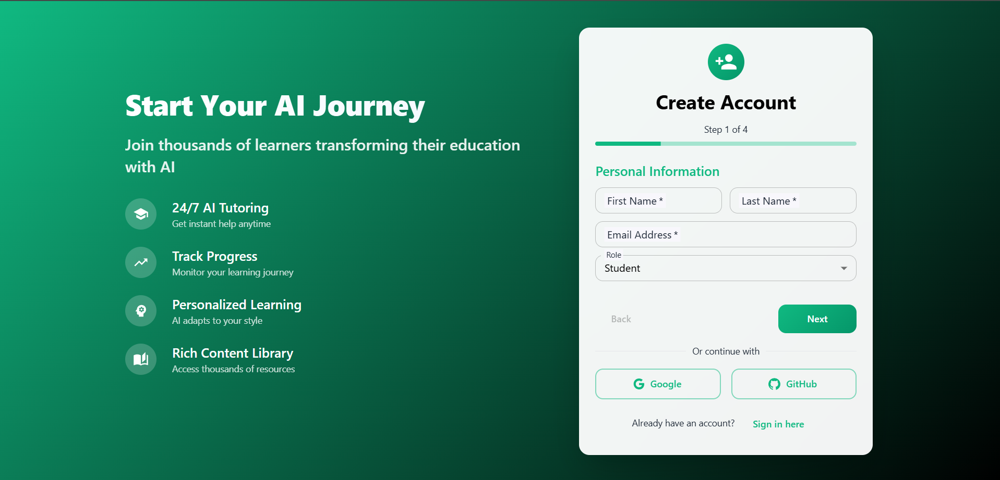
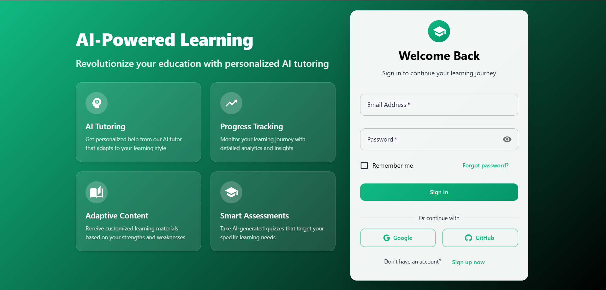
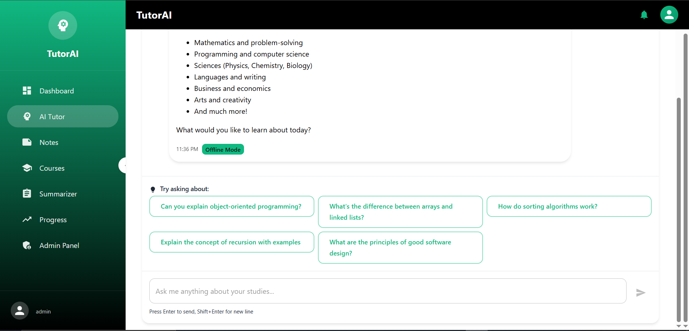
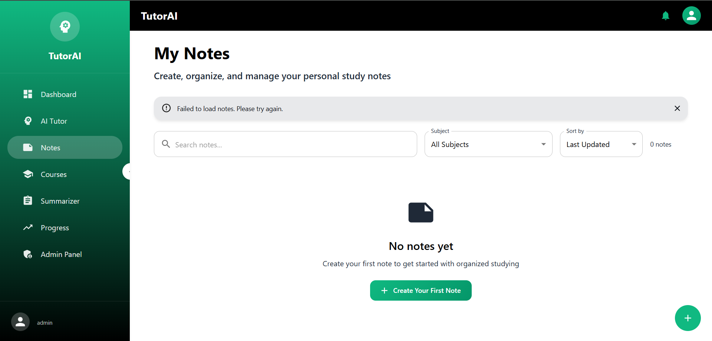
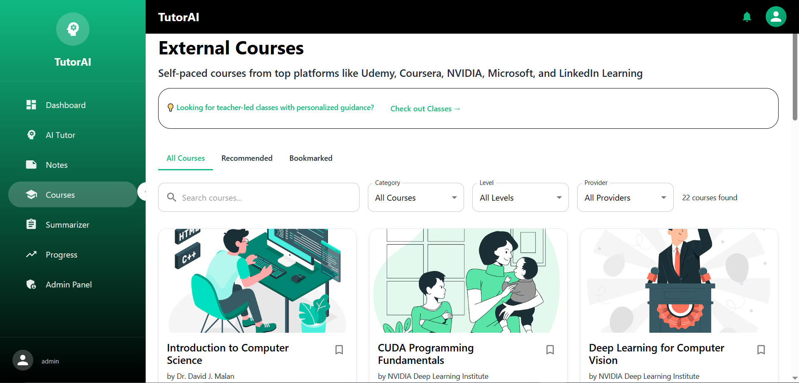
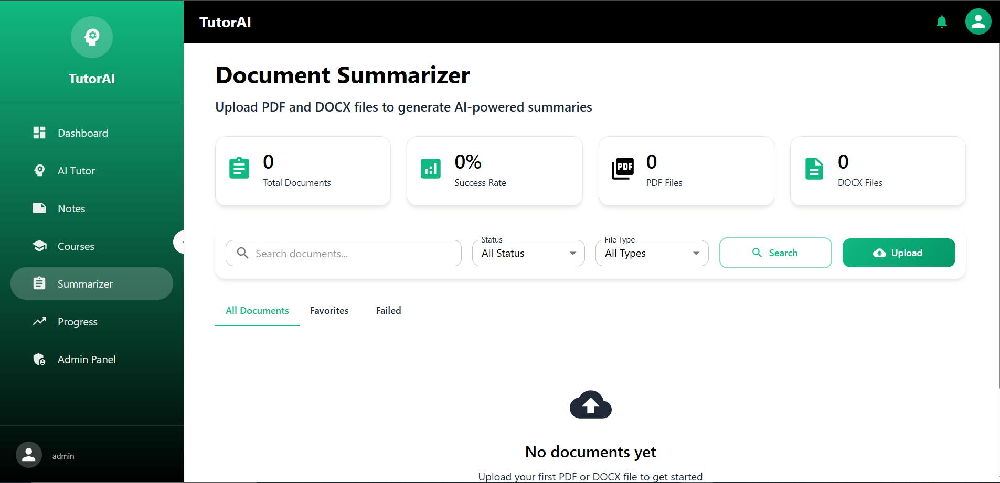
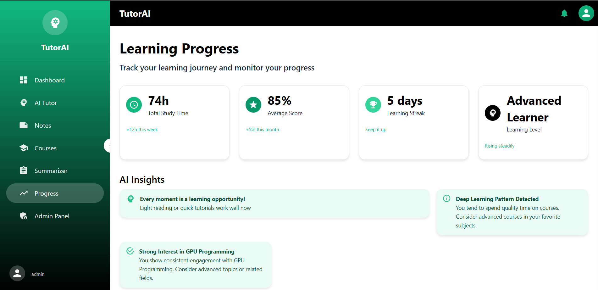
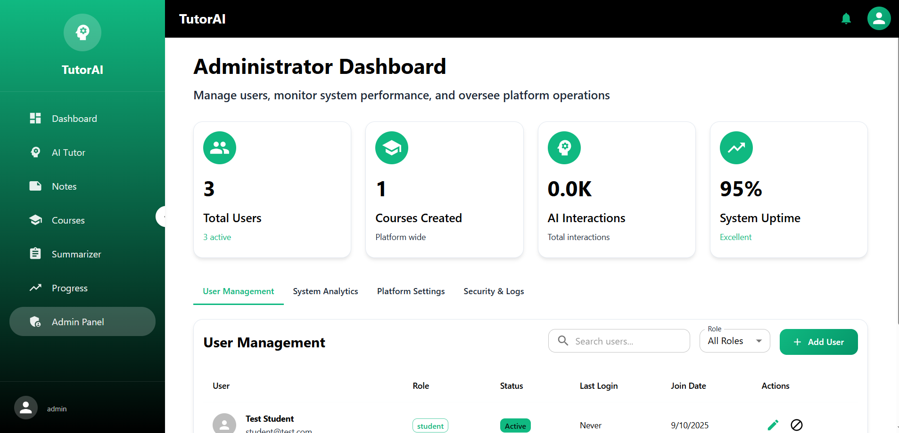

# TutorAI - Personalized Learning Platform

[](https://opensource.org/licenses/MIT)
[](CONTRIBUTING.md)
[](SECURITY.md)

## Description

TutorAI is a personalized learning platform designed to provide students with a tailored educational experience. Leveraging AI-powered tools, TutorAI offers features such as intelligent tutoring, automated assessments, document summarization, and personalized learning recommendations. The platform aims to make education more accessible, engaging, and effective for learners of all levels.

## UI

Here are some screenshots of the TutorAI user interface:










## Key Features

-   **Document Summarizer:** Quickly summarize lengthy documents to extract key information.
-   **Free Courses, with Certificates:** Access free courses and earn certificates upon completion.
-   **Notes:** Create and manage personal notes.
-   **AI Tutor:** Interact with an AI tutor for personalized guidance and support.
-   **Progress Tracker:** Monitor learning progress and identify areas for improvement.
-   **Daily Quotes Feature:** Get inspired with daily quotes.
-   **Personalized Recommendations:** Receive tailored learning recommendations based on individual needs and goals.
-   **User Management:** Manage user profiles, roles, and permissions.

## Tech Stack

### Backend

-   **Python:** Programming language
-   **Django:** Web framework
-   **Django REST Framework:** API development
-   **MySQL:** Database
-   **DeepSeek API:** AI services
-   **OpenRouter API:** AI services

### Frontend

-   **React:** JavaScript library for UI development
-   **JavaScript:** Programming language
-   **npm:** Package manager

## Installation

Follow these steps to set up the project locally:

1.  **Clone the repository:**

    ```bash
    git clone https://github.com/MuhammadHashirSuleman/TutorAI---Personalized-Learning-System.git
    cd TutorAI---Personalized-Learning-System
    ```

2.  **Backend Setup:**

    ```bash
    cd backend
    python -m venv venv
    # Windows
    venv\\Scripts\\activate
    # macOS/Linux
    source venv/bin/activate
    pip install -r requirements.txt
    cp .env.example .env
    # Edit .env with your configuration
    python manage.py makemigrations
    python manage.py migrate
    python manage.py runserver
    ```

3.  **Frontend Setup:**

    ```bash
    cd frontend
    npm install
    npm start
    ```

## Usage

### API Endpoints

The backend provides a REST API for accessing various features of the platform. Here are some of the key endpoints:

-   `/auth/register/`: Register a new user account.
-   `/auth/login/`: Authenticate user and receive JWT tokens.
-   `/courses/`: List all available courses.
-   `/chatbot/chat/`: Interact with the AI tutor chatbot.
-   `/summarizer/document/`: Summarize uploaded documents using AI.
-   `/recommendations/`: Get personalized learning recommendations.
-   `/progress/`: Get user's learning progress.
-   `/users/profile/`: Get detailed user profile information.

For more details, see the [API Documentation](API_DOCUMENTATION.md).

### Authentication

The API uses JWT (JSON Web Tokens) for authentication. All protected endpoints require a valid JWT token in the `Authorization` header.

```
Authorization: Bearer <your_jwt_token>
```

## Contributing

We welcome contributions to TutorAI! Please see our [Contributing Guidelines](CONTRIBUTING.md) for details on how to get involved.

## Security

Please see our [Security Guidelines](SECURITY.md) for information on how to keep TutorAI secure.

## License

This project is licensed under the MIT License - see the [LICENSE](LICENSE) file for details.

## Contact

If you have any questions or feedback, please feel free to contact us.


